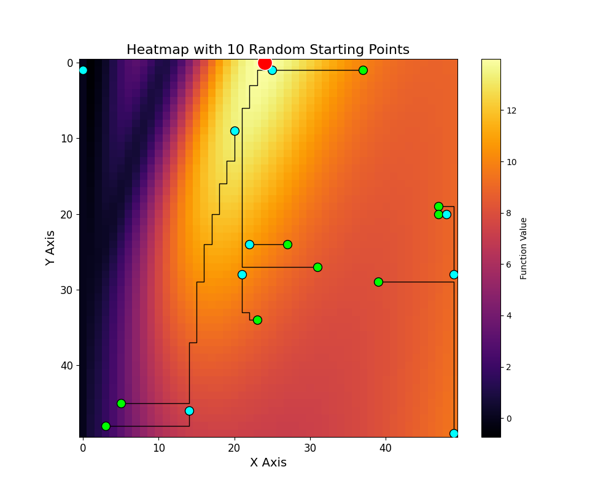
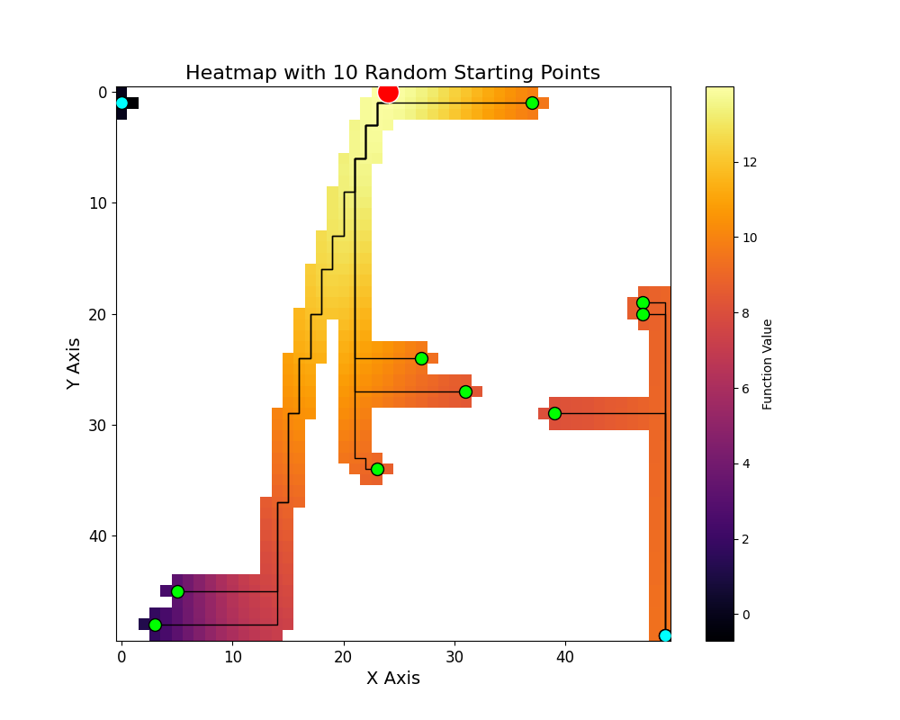

# 2d-hill-climbing-optimization

This project implements a Hill Climbing optimization algorithm combined with Monte Carlo random sampling over a 2D function surface. It compares different optimization strategies and performance improvements using lazy computation and path-based memoization.

A heatmap is generated to display:
- Random starting points
- Optimization paths
- Local maxima found by Hill Climbing
- The real global maximum

The program also prints runtime statistics and traversal metrics.


## Four Program Variants

The repository contains **four executables**, allowing comparison between different implementations:

| Program | Memoization 1 | Memoization 2 | Description |
|--------|:-------------:|:-------------:|-------------|
| `hc` | No | No | Baseline Hill Climbing implementation — no memoization |
| `hc_mem1` | Yes | No | Stops when reaching a cell already visited by a previous path |
| `hc_mem2` | No | Yes | Only computes function values for visited cells |
| `hc_both` | Yes | Yes | Both optimizations enabled for maximum performance |

This allows performance comparisons (runtime, visited points, success rate) under identical test conditions.


## Goal

Evaluate how Hill Climbing performs in a two-dimensional search space by analyzing:

- Efficiency vs. brute-force search
- Likelihood of reaching the global maximum
- Influence of matrix size (N) and number of random starting points (p)


## How It Works

1. A square matrix of size **N × N** is generated, each cell computed using a mathematical function based on coordinates (x, y).
2. **p** random starting points are generated using a Linear Congruential Generator (LCG).
3. From each starting point, Hill Climbing moves only to the best neighbor among:
   - Up, Down, Left, Right
4. The algorithm stops when a local maximum is reached.
5. A full brute-force scan finds the true global maximum for comparison.
6. A heatmap visualizes:
   - The matrix values
   - All random starting points
   - All visited ascents
   - Final local maxima
   - The global maximum position


## Memoization Techniques Used

### Memoization 1: Stopping recurring paths
If a path reaches a cell previously visited by a fully resolved path, it will inevitably lead to the same final maximum.  
The program stops early to prevent redundant computation.

### Memoization 2: Lazy function evaluation
Values of the function are only computed when a cell is visited during Hill Climbing.  
The matrix is not fully computed unless required by brute-force search.

Both optimizations significantly reduce runtime and memory usage for large N and p.


## Performance Results

Test parameters:

```bash
N = 1500
p = 80
Seed = 824482
```

Measured times (in seconds) and total steps:

| Program         | T.Initialization | T.PathTraversal | T.BruteForce | T.Total | Total Steps |
|-----------------|-----------------|----------------|--------------|---------|-------------|
| hc         | 2.447375        | 0.200842       | 1.529515     | 3.976890| 77297       |
| hc_mem1    | 2.445347        | -              | 0.562829     | 3.008176| 28879       |
| hc_mem2    | 0.006184        | -              | 1.582978     | 1.589162| 77297       |
| hc_both   | 0.005002        | -              | 0.660008     | 0.665010| 28879       |

Notes:

- "-" indicates the path traversal time is negligible or combined with other steps.


## Requirements

- Python 3.x
- Required libraries:
  - numpy
  - matplotlib

Install dependencies:
```bash
pip install numpy matplotlib
```

## Usage

Run from terminal:
```bash
./hc <print_option> <N> <p> <seed>
```

| Argument     | Type    | Description                            |
| ------------ | ------- | -------------------------------------- |
| print_option | s / n   | Print full matrix: "s" yes, "n" no     |
| N            | integer | Matrix size (NxN)                      |
| p            | integer | Number of random starting points       |
| seed         | integer | Seed for random number generator (LCG) |

## Example
```bash
./hc s 50 10 12345
```
```bash
./hc_mem1 s 50 10 12345
```
```bash
./hc_mem2 s 50 10 12345
```
```bash
./hc_both s 50 10 12345
```
### Console output

Console output includes:
- Full matrix (if print_option = "s")
- Matrix generation time (T_i)
- Brute-force search time (T_r)
- Hill Climbing time (T_m)
- Global maximum position and value
- Best local maximum found by Monte Carlo
- Total number of visited points
- Heatmap visualization popup

### Graphic ouput







## Heatmap Interpretation

Visual markers include:
- Green points: Random starting positions
- Blue points: Local maxima found by Hill Climbing
- Red circle: True global maximum
- Black lines: Optimization paths (trajectory taken)

The visualization makes it easy to observe whether Hill Climbing
successfully escapes local maxima or gets stuck.


